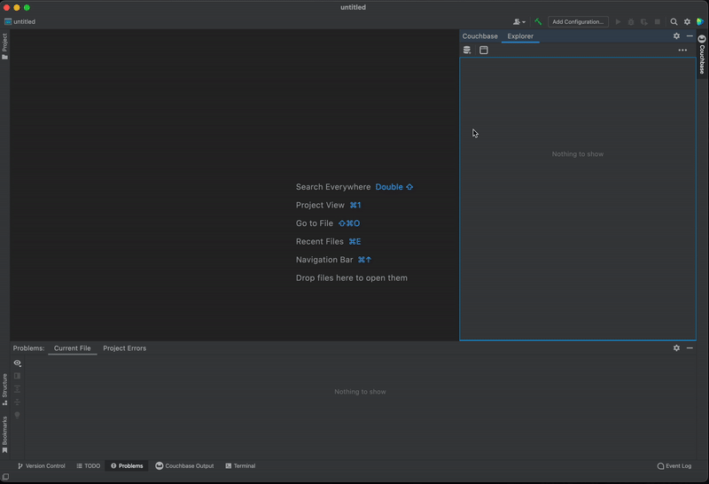
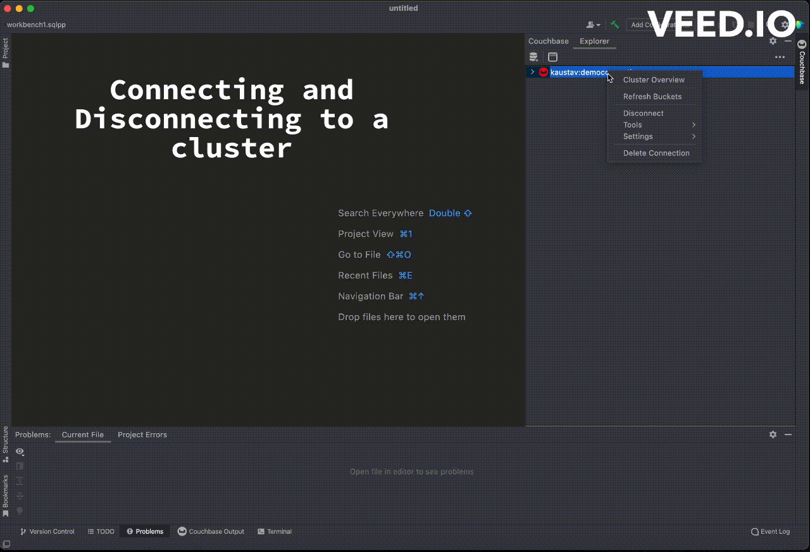
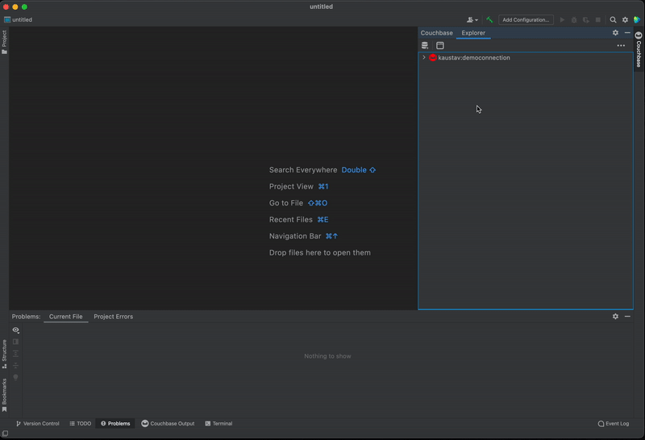
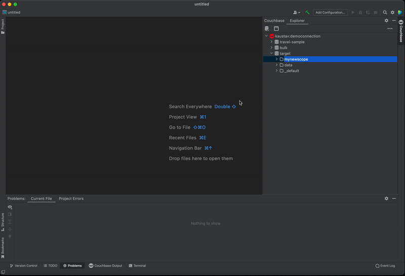
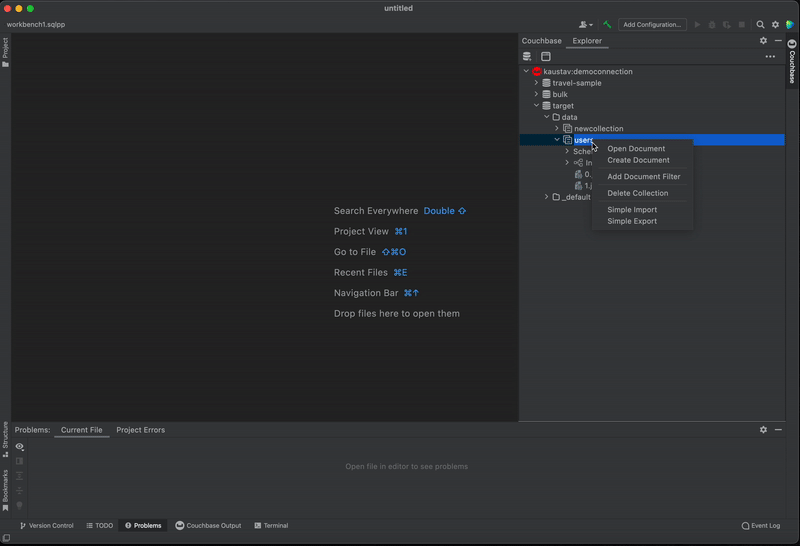

# Intellij-Couchbase README

Welcome to the official Intellij Idea extension for Couchbase!

This plugin is designed to provide a seamless experience for Couchbase Server users who want to work within the popular Intellij Idea editor.

# Requirements
This extension requires Couchbase Server to be installed on your system in order to install successfully.

To install Couchbase Server, please follow the steps mentioned in [this guide](https://docs.couchbase.com/server/current/install/install-intro.html).

# Quick Tour

### Add Cluster Connection
To connect to a Couchbase Cluster, follow these steps:
1. Click on the "Add" icon.
2. Complete all the required fields with the necessary details.
3. Check "Use Secure Connection" if you are connecting to Capella.
4. Finally, click on the "Connect" button to establish a connection to the cluster.

### Connect, Disconnect or Delete a Cluster Connection
Right-click on the connection to open the context menu. From the context menu, you will be able to choose between options to Connect, Disconnect or Delete the Cluster.

### Interact with Buckets and Scopes
Click on the bucket to see the list of Scopes associated with that bucket. Open the context menu on bucket to undertake actions such as creating a new Scope, refreshing existing Scopes, or obtaining administrative information about the Bucket.

### Interact with Collections and Indexes
Click on Scope to list Collections and Indexes. Open context menu on Collection directory to create a new Collection or to refresh Collections.

### Interact with Documents
1. Click on the desired Collection to list all the documents that have been stored within it.
2. To open a specific document, click on it to view its details and make any necessary changes.
3. If you need to create a new document or search for an existing one, you can open the context menu by right-clicking on the Collection directory.
4. Once you have made any necessary changes to a document, you can save it using the "Ctrl + S" or "Cmd + S" shortcut keys.

### Open SQL++ Notebook
1. Simply right-click on the Cluster and select the "New SQL++ Notebook" option from the context menu.
2. Once you have opened the notebook, you will be presented with a powerful text editor that allows you to craft your SQL++ queries with ease.
3. And once you have completed your work, you can save the notebook to your local machine for future reference.

## License
Apache Software License Version 2.  See individual files for details.